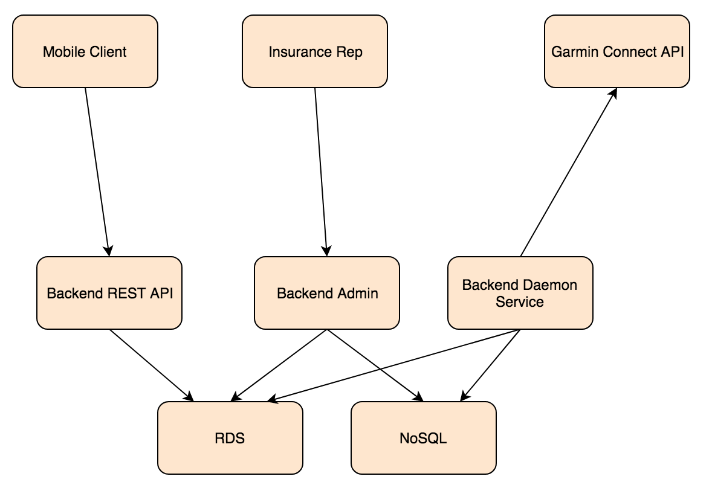

# CCPS

A Platform which integrates with wearable and mobile devices in order to improve the health status of insured persons. With the person health status improvement, insurance companies will benefit by the claim reduction. BeHealthy platform will also act as a channel for promotions and offering based on data collected by the insured persons.

## Components

Component Diagram:

## Stack

* Mobile: Ionic Framework / AngularJS
* Backend server API: Django + Django-Rest-Framework
* Backend RDS database: PostgreSQL
* Containers built/run using Docker
